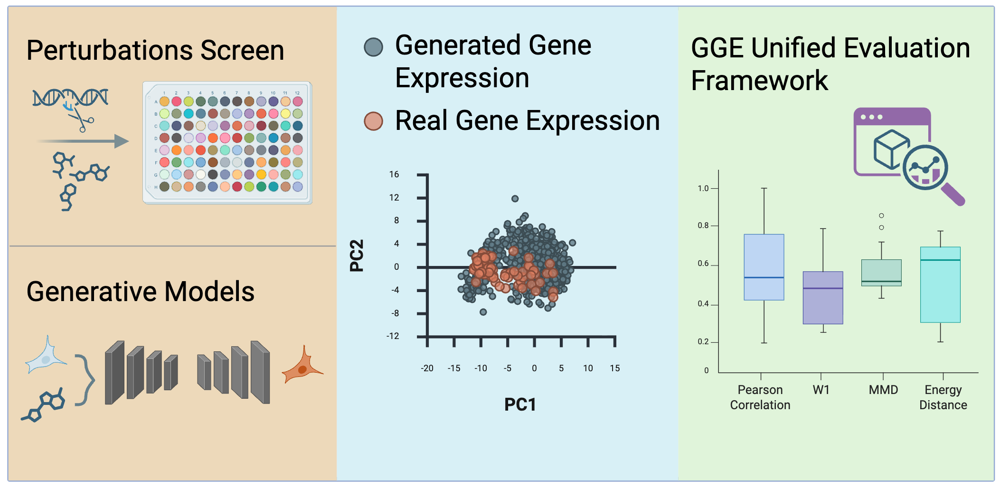

# GGE: A Standardized Framework for Evaluating Gene Expression Generative Models

[](https://badge.fury.io/py/gge-eval)
[](https://www.python.org/downloads/)
[](https://opensource.org/licenses/MIT)
[](https://github.com/AndreaRubbi/GGE/actions)
[](https://andrearubbi.github.io/GGE/)

> **Paper**: Accepted at the <a href="https://genai-in-genomics.github.io/index.html">**Gen2 Workshop at ICLR 2026** </a>



**Comprehensive, standardized evaluation of generated gene expression data.**

GGE (Generated Genetic Expression Evaluator) addresses the urgent need for standardized evaluation in single-cell gene expression generative models. Current practices suffer from inconsistent metric implementations, incomparable hyperparameter choices, and lack of biologically-grounded metrics. GGE provides:

- **Comprehensive suite of distributional metrics** with explicit computation space options
- **Biologically-motivated evaluation** through DEG-focused analysis with perturbation-effect correlation
- **Standardized reporting** for reproducible benchmarking

## Key Features

- Per-metric space configuration (raw, PCA, DEG)
- Perturbation-effect correlation (Paper Eq. 1)
- Configurable DEG thresholds
- GPU (CUDA) and Apple MPS acceleration
- Per-gene and aggregate metrics
- Publication-quality visualizations (static and interactive)
- Simple Python API and CLI
- Mixed-space evaluation with `evaluate_lazy()`

## Metrics
All metrics are computed **per-gene** (returning a vector) and **aggregated**:

| Metric | Description | Direction |
|--------|-------------|-----------|
| **Pearson Correlation** | Linear correlation between expression profiles | Higher is better |
| **Spearman Correlation** | Rank correlation (robust to outliers) | Higher is better |
| **R²** | Coefficient of determination | Higher is better |
| **Perturbation-Effect Correlation** | Correlation on (real - ctrl) vs (gen - ctrl) | Higher is better |
| **MSE** | Mean Squared Error | Lower is better |
| **Wasserstein-1** | Earth Mover's Distance (L1) | Lower is better |
| **Wasserstein-2** | Sinkhorn-regularized OT | Lower is better |
| **MMD** | Maximum Mean Discrepancy (RBF kernel) | Lower is better |
| **Energy Distance** | Statistical potential energy | Lower is better |

## Visualizations

- Boxplots and violin plots for metric distributions
- Radar plots for multi-metric comparison
- Scatter plots for real vs generated expression
- Embedding plots (PCA/UMAP) for real vs generated data
- Heatmaps for per-gene metric values
- Interactive Plotly plots with density overlays and metadata coloring

## Computation Spaces

GGE treats computation space as a **first-class parameter** (see Paper Section 3.3):

| Space | Description | When to Use |
|-------|-------------|-------------|
| **Raw Gene Space** | Full ~5,000–20,000 gene dimensions | Gene-level interpretability needed |
| **PCA Space** | Reduced k-dimensional space (default: 50) | Primary distributional metrics |
| **DEG Space** | Restricted to differentially expressed genes | Biologically-targeted evaluation |

**Recommendation**: Use multi-space evaluation—PCA-50 for distributional metrics, DEG for biological focus.

## Installation

```bash
pip install gge-eval
```

The package includes GPU-accelerated metrics via geomloss, which automatically falls back to CPU if no GPU is available.

## Quick Start

### Python API

```python
from gge import evaluate

# From file paths
results = evaluate(
    real_data="real_data.h5ad",
    generated_data="generated_data.h5ad",
    condition_columns=["perturbation", "cell_type"],
    split_column="split",  # Optional: for train/test
    output_dir="evaluation_output/"
)

# From AnnData objects
import scanpy as sc
real_adata = sc.read_h5ad("real_data.h5ad")
generated_adata = sc.read_h5ad("generated_data.h5ad")

results = evaluate(
    real_data=real_adata,
    generated_data=generated_adata,
    condition_columns=["perturbation"],
)

# Access results
print(results.summary())

# Get metric for specific split
test_results = results.get_split("test")
for condition, cond_result in test_results.conditions.items():
    print(f"{condition}: Pearson={cond_result.get_metric_value('pearson'):.3f}")
```

## Contributing

Contributions are welcome! Please feel free to submit a pull request or open an issue.

## Citation

If you use GGE in your research, please cite our paper:

```bibtex
@misc{rubbi2026gge,
  title  = {A Standardized Framework for Evaluating Gene Expression Generative Models},
  author = {Rubbi, Andrea and Di Francesco, Andrea Giuseppe and Lotfollahi, Mohammad and Liò, Pietro},
  year   = {2026},
  note   = {Presented at the GenAI in Genomics Workshop at ICLR 2026},
  url    = {https://genai-in-genomics.github.io/}
}
```

or the software

```bibtex
@software{rubbi2026gge,
  author = {Rubbi, Andrea},
  title  = {GGE: Generated Genetic Expression Evaluator},
  year   = {2026},
  url    = {https://github.com/AndreaRubbi/GGE}
}
```

## License

This project is licensed under the MIT License. See the LICENSE file for details.